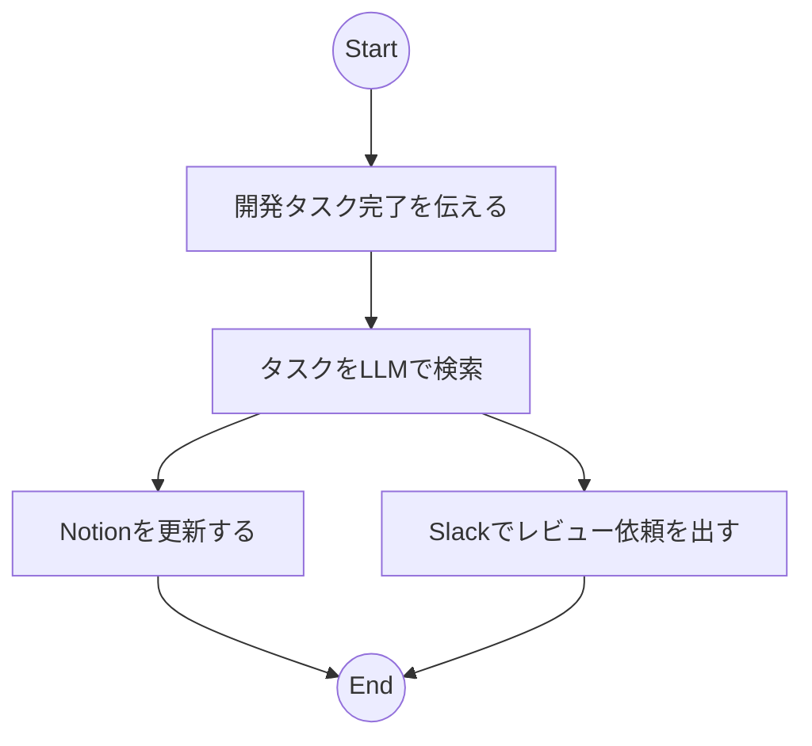

2024年11月23日(土)、東京・大崎にあるファインディ株式会社様のイベントスペースにて「Fullstack AI Dev & Raycast Summit feat. Satoshi Nakajima」を開催いたしました。本記事ではトークセッション3 および スポンサートークについて紹介いたします。

イベントレポートのメイン記事は[こちら](https://zenn.dev/raycast_jp/articles/2024-11-23-fullstack-ai-dev-n-raycast-summit-main)です。

# 1. 草間一人氏 / AI x インシデント管理で拡げるサービスオーナーシップ
:::message
**草間一人氏 プロフィール**  
所属：PagerDuty株式会社 / 職種：Product Evangelist
通信事業者でプラットフォームエンジニアを務めたのを皮切りに、いくつかの外資系企業でプロフェッショナルサービスやプリセールスエンジニアとしてクラウドネイティブやプラットフォーム製品に携わるなど、10年以上さまざまな形でプラットフォームに関与している。2023年11月より現職。一般社団法人クラウドネイティブイノベーターズ協会 代表理事。Platform Engineering Meetupオーガナイザー
X: https://x.com/jacopen
GitHub: https://github.com/jacopen
:::

## 1.1. 登壇概要 (Claude による要約をベースに編集)
### 1.1.1. はじめに

近年のDevOps環境において、インシデント管理は開発ライフサイクルの重要な要素となっています。PagerDutyを例に、AIを活用したインシデント管理の現状と、開発者のサービスオーナーシップについて解説します。

### 1.1.2. インシデント管理の課題と解決策

**インシデント管理の現状**

システム運用において、監視ツールからの大量のアラートは日常的な課題となっています。これらのアラートを効果的に管理し、適切に対応することが重要です。PagerDutyのようなツールは、機械学習を活用して優先順位付けを行い、本当に重要なインシデントのみを通知する機能を提供しています。

**AIによる支援機能**

 PagerDutyは、以下のような機能でエンジニアを支援しています：

- アラートのインテリジェントなフィルタリング
- 状況に応じた通知方法の最適化（Slack、電話、プッシュ通知など）
  - 例えば、
    - 365日/24時間対応が必要なサービスなら深夜帯にオンコールする
    - オンコールも担当者のローテーションを考慮する  

   といったことが可能です。
- インシデント情報の自動集約と状況サマライズ
- ポストモーテムの作成支援
  - 受信したイベント、ステータスアップデート、インシデントノート、Slackの会話などからタイムラインを作成

### 1.1.3. DevOpsとサービスオーナーシップの進化

**フルサービスオーナーシップ**

書籍（エレガントパズル）でも記述されているように、システム障害の約70%はデプロイメント後に発生しています。この現状は、開発者が運用フェーズにも関与する必要性を示しています。そのため、PageDuty では「コードを書いた者が、その責任を負う、」設計と実装の点から見て、テクノロジーに最も精通した人が製品開発ライフサイクル全体の責任を引き受ける「フルサービスオーナーシップ」という運用モデルをサポートします。

**AIによる支援の重要性**

開発者がインシデント対応に注力できるように、PageDuty ではAIを活用しています。例えば、

- インシデント発生時の関連情報の自動収集と分析
  - 直近の変更情報、過去インシデントの情報、他システムの稼働状況など原因究明に必要な情報収集等
- 社内ステークホルダー（ユーザーサポート、上司など）とのコミュニケーション支援
  - インシデント用の Slack チャネル開設および関係者の招待
  - Zoom ミーティングの開設
  - インシデントの状況を原因究明者ではなく、生成AI に聞いてもらう  
  - 等
- インシデントの再発防止のための分析と提案

### 1.1.4. まとめ

インシデント管理におけるAIの活用は、開発者のサービスオーナーシップを支援する重要な要素となっています。これにより、開発者は質の高いサービス提供に注力しつつ、効率的なインシデント対応を実現できます。将来的には、AIによる支援がさらに進化し、より効果的なインシデント管理が可能になると期待されます。

## 1.2. YouTube Link

https://www.youtube.com/live/sPTnyuO9OCA?si=mB0baCU17859UCWb&t=8777

## 1.3. 登壇資料
@[speakerdeck](2a31b7c5f4ba41c4bdb039b23556cc59)

# 2. 矢野通寿氏 / GraphAI x Raycastで自然言語で様々なワークフローの実行できるようにする試み
:::message
**矢野通寿氏 プロフィール**  
所属：株式会社All Ads / 職種：ソフトウェアエンジニア
自社の広告成果計測システムの開発を中心にアドテク関連のプロダクトをフルスタックに開発している。
Raycast OSS ContributorでRaycast Community Japanを運営中。
X: https://x.com/nagauta_jp
GitHub: https://github.com/nagauta
Raycast: https://www.raycast.com/nagauta
:::

## 2.1. 登壇概要 (Claude による要約をベースに編集)
### 2.1.1. 背景と目的
Raycast Community Japan のリーダーとして Raycast の普及に取り組んでいます。また、シンギュラリティ・ソサイティのハッカソンで GraphAI の可能性に着目し、両者を組み合わせた新しい AIエージェントの開発に取り組んでいます。

### 2.1.2. Raycastの概要と特徴
Raycastは、イギリスのスタートアップが開発した生産性向上ツールです。様々なアプリケーションへの素早いアクセスを可能にし、クリップボード管理(テキスト、カラーコード、画像等)や計算機能(四則演算、時差、為替等)など、日常的な作業を効率化します。最近ではAI機能の充実により、グローバルで高い評価を受けています。

### 2.1.3. 開発中のプロジェクト「Amaterasu」
現在開発中の [Amaterasu](https://github.com/raycast-jp/amaterasu) は、Raycast と GraphAI を組み合わせたAIエージェントツールです。
Raycast 上でタスク完了等の報告を Trigger に、Notion 上のチケット更新、Slack に対してレビュー依頼を出すといった複数の処理を並行して実行することを目標にしております。

### 2.1.4. 今後の展望
まだ試行錯誤の段階ですが、GraphAI と Raycast を組み合わせることで、より柔軟なAIエージェントツールの実現を目指しています。開発が進み次第、詳細な情報を公開する予定です。

重要なポイントは、生産性向上ツールである Raycast と、非同期処理に優れた GraphAI を組み合わせることで、より使いやすく効率的なAIエージェントの実現を目指していることです。今後のさらなる発展が期待されます。

### 2.1.5. 質疑（一部）
Raycast 本体は Swift で書かれていますが、拡張機能の開発は TypeScript と React を使用します。コミュニティへの貢献として、拡張機能を新規開発して公開する方法と、他者が公開している拡張機能に対してPull Request（改善提案）する方法があります。

## 2.2. YouTube Link

https://www.youtube.com/live/sPTnyuO9OCA?si=n2jQc5I9bp73d0Hi&t=9844

## 2.3. 登壇資料
@[docswell](https://www.docswell.com/s/nagauta/KMX66J-FullstackAIDev2024)

# 3. しょっさん（@sho7650）氏 / Raycast Proで、あらゆるコンテンツをすばやく解読する
:::message
**しょっさん（@sho7650） プロフィール**  
所属：青いクラウドサービスの会社 / 職種：テクニカルアーキテクト
前職は深い青色の会社でアプリ開発以外の全てを担当していました。スペシャリストからアーキテクト、コンサルタントへと役割を変えていきました。今は、青いクラウドサービスの会社でインフラよりの全ての技術面を支援するプリセールスアーキテクトとして働いています。

X: https://x.com/sho7650
note: https://note.com/sho7650
:::

## 3.1. 登壇概要 (Claude による要約をベースに編集)
### 3.1.1. はじめに
コマンド型ランチャーシステム「Raycast」の便利な機能について、「あらゆるコンテンツをすばやく解読する」をテーマに厳選した機能を解説します。

### 3.1.2.  Summarize Webpage
現在閲覧中の Webページでショートカットキーを実行することで、

- 海外の長い英文サイトの要約
- AI チャットを通した理解促進
- サイト中の画像も活用したチャット

などが行えます。Browser Extension を入れる必要がありますが、URLのコピー&ペーストなどの手間を省き、現在閲覧中のページに対してすぐに利用できるのがメリットです。

なお、この機能を利用するには「Raycast Pro」が必要です。

### 3.1.3. Quicklinks 機能を活用した辞書利用
Raycast の標準機能 Quicklinks を活用することで、辞書アプリを効率よく利用できます。
今回は「物書堂」の辞書を例に説明します。「物書堂」は串刺し検索検索等の機能が充実しており、英語等の語彙力強化に欠かせません。

手順としては以下の通りです。
- ショートカットキーで Raycast 立ち上げ
- `;d` と打ち込み
- `Query`に調べたい単語を入れる
- すると、「物書堂」アプリに入っているすべての辞書を検索し結果を返す

登壇資料での設定は以下の通りです。
- Name: `;d` 
- Link: `mkdictionaries:///？text=｛Query｝`
- Open ith: `Dictionaries （Default）`

## 3.2. YouTube Link

https://www.youtube.com/live/sPTnyuO9OCA?si=FOU8SEgVRWL6JO-r&t=11111

## 3.3. 登壇資料(Google Slide へのLink)
https://docs.google.com/presentation/d/1QgC38fHaknXQ3Fi3107HxWVg-utg_vDVxktjZXlV6D0/edit?usp=sharing

# 4. 株式会社Macbee Planet様 / スポンサートーク
:::message
**株式会社Macbee Planet様 会社情報**  
当社では「LTVを予測し、ROIの最適化を実現する」ため、データとテクノロジーを活用してクライアントのマーケティング支援を行っています。
成熟していないLTVマーケティング市場において、私たちはそのマーケットリーダーとして、インターネット広告業界の課題を解決し、3兆円のインターネット広告市場をLTVマーケティングへ転換することを目指しています。
2020年3月に創業5年でマザーズに上場、また2024年7月にプライム市場へ上場し、売上高は390億円（2024年4月期実績）を超えました。
現在は第2創業期を迎えており、更なる成長を実現するために体制の強化を図っています。
[採用情報](https://hrmos.co/pages/macbeeplanet/jobs)
[株式会社AIVIA採用情報](https://hrmos.co/pages/macbeeplanet/jobs/00027)
:::

## 4.1. 登壇概要  (Claude による要約をベースに編集)
### 4.1.1. 会社概要

Macbee Planet は2015年設立のB2B広告コンサルティング企業です。データとテクノロジーを活用してマーケティング課題を解決し、広告主のLTV(Life Time Value)向上と効果的な集客を実現することにコミットしています。2024年にはプライム市場への上場を果たし、M&Aも積極的に展開しています。

### 4.1.2. 主要事業
1. アナリティクスコンサル事業
  - LTVデータの解析
    - メディアや自社ツールから取得できるデータを解析し、見込みユーザーのLTVを算出
  - 2 データを活用し成果報酬型で集客
    - データを基に当社のコンサルタントがプランニングし、新規ユーザーの集客を成果報酬型で実施

2. マーケティングテクノロジー事業
    エンジニアが開発したプロダクトを通じて高い収益率(95%以上)を実現しています。主な製品・サービスには以下があります：

   - 3DAD：インタラクティブな3D広告配信プラットフォーム
     -  3Dやインタラクション性のあるクリエイティブ
     -  機械学習によって最適化された配信ロジック
   - DATAHIVE：日本初のリバースETLサービス
     - 広告データの統合と活用
     - データウェアハウスを活用したマーケティング最適化
   - LP Pro：ランディングページ制作ツール
     - 広告運用者向けにノーコードで記事型のランディングページを作成
     - 広告の配信・分析までワンストップで可能なマーケティングツール

### 4.1.3. AI/LLM関連の取り組み
- Hachimitsu AI
   - 広告バナーを学習させる事により、CTRが高い当たりバナーの改善項目を提案するAI
 - watermark 検出
   - Figmaページ内にwatermarkつきの画像がないか検出するFigma Plugin。
   - 人目で気付けないクリエイティブ内のwatermark検出で、広告主のレピュテーションリスクを防ぐ。
- 広告文審査
   - LLMによる広告文の自動審査を行い、クライアント側のルールや法に触れていないかの判定を行う

### 4.1.4. エンジニア文化
「Be Open」を重視し、以下のような文化を醸成しています：
- 社内勉強会の積極的な開催
- Slackを活用した活発なコミュニケーション
- 部署の壁を超えたプロジェクトベースの協働
- チャレンジを推奨する組織風土

今回の大規模なコミュニティイベントも元々は社内の Raycast 勉強会から発展したものです。
エンジニア同士が積極的に学び合い、挑戦を後押しする文化が根付いています。

## 4.2. YouTube Link

https://www.youtube.com/live/sPTnyuO9OCA?feature=shared&t=11914