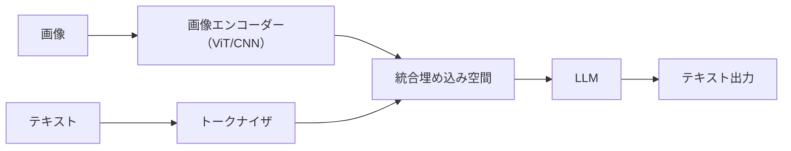

## マルチモーダルLLMとCNNの違いと使い分け：徹底整理ブログ

近年話題のマルチモーダルLLMと、従来の画像処理技術であるCNN（YOLO, ResNetなど）との違いについて、実際に何ができて、何が得意なのかをわかりやすく整理しました。

---

### 1. マルチモーダルLLMとは？

マルチモーダルLLMは、画像・テキスト・音声など複数のモダリティを統合して処理できる大規模言語モデル（LLM）の拡張版です。

- 例: GPT-4V, Gemini 1.5, CLIP, LLaVA
- 通常のLLM（GPT-4, LLaMAなど）はテキストしか処理できませんが、マルチモーダルLLMは画像や音声も理解可能です。

#### 画像認識の仕組み（簡略）
1. ViT（Vision Transformer）やCNNで画像を特徴ベクトルに変換
2. テキストはTokenizerでトークン化
3. 双方を統合して埋め込み空間へ
4. LLMに入力 → 推論・生成

---

### 2. 画像はそのままLLMに入らない？

はい、画像はそのままLLMには入れられません。
そのため、事前に以下のような"前処理"が行われます：

- リサイズ・正規化（例: 224×224px）
- ViTまたはCNNで特徴抽出（エンコーダー）
- テキストと同様のベクトル表現に変換し、LLMと統合

この処理により、マルチモーダルLLMは画像とテキストを同時に理解することが可能になります。

---

### 3. CNN（YOLO, ResNet）とTransformer（ViT, CLIP）の違い

#### ✅ CNN（YOLO, ResNet）の特徴
- 局所的な特徴（エッジ・形状）を畳み込みフィルタで抽出
- 高速・軽量でリアルタイム処理向き
- 物体検出、画像分類、セグメンテーションに強い
- 画像全体の意味理解やマルチモーダル統合は苦手

#### ✅ Transformer（ViT, CLIPなど）の特徴
- 画像全体をパッチに分割し、Self-Attentionで文脈理解
- 画像とテキストの統合処理が得意（例: GPT-4V, CLIP）
- 長距離関係の学習に強いが、処理が重くリアルタイムには不向き

#### ✅ 結論：用途によって使い分けよう
- リアルタイム物体検出：CNN（YOLOなど）
- 画像＋テキスト統合・意味理解：Transformer（ViT, GPT-4V）

---

### 4. マルチモーダルLLMの学習スタイル

#### ✅ 統合モデル（Unified Model）
- ViTとLLMを統合して同時に学習（例: GPT-4V, Gemini）
- 高い表現力と柔軟性を持つ

#### ✅ モジュール分離型（Modular Approach）
- CNNやViTで画像特徴を事前学習 → LLMと後から統合（例: CLIP, LLaVA）

現在の主流は統合モデルで、より自然なマルチモーダル推論が可能です。

---

### 5. Transformerは画像分類が苦手なのか？

答えは**NO**です。
ViTやその派生モデル（Swin Transformer, DeiTなど）は、ImageNetでResNetと同等以上の画像分類精度を達成しています。

#### ✅ ViTが得意なこと
- 大規模データでの高精度分類
- 画像全体の意味や文脈理解
- ゼロショット分類（CLIPなど）

#### ❌ ViTが苦手なこと
- 少ないデータでの学習（CNNに劣る）
- 処理コストが高く、軽量化が必要
- 位置情報の保持に工夫が必要

#### CNN vs Transformer（画像分類）比較表
| 項目 | CNN | Transformer |
|------|------|-------------|
| 小規模データ | 強い | やや弱い |
| リアルタイム処理 | 得意 | 苦手 |
| 意味理解 | 苦手 | 得意 |
| ゼロショット分類 | 不得意 | 得意 |

---

### 6. まとめ

- マルチモーダルLLMは画像・テキストを統合して処理する次世代AI
- ViTやCNNで画像を前処理して、LLMと融合
- CNNはリアルタイム処理に強く、Transformerは意味理解に優れる
- 画像分類においてTransformerも高性能（用途で使い分け）

**つまり、CNNとTransformer、どちらが優れているかではなく、何に使うかが重要！**

|元文章|チェック結果|説明|ソース|修正提案|
|---|---|---|---|---|
|マルチモーダルLLMは、画像・テキスト・音声など複数のモダリティを統合して処理できる大規模言語モデル（LLM）の拡張版です。|正確|マルチモーダルLLMの定義は正確です。| [^1] [^2] [^3]|変更不要|
|例: GPT-4V, Gemini 1.5, CLIP, LLaVA|部分的に正確|GPT-4V、CLIP、LLaVAは正確ですが、Gemini 1.5については確認が必要です。| [^2] [^3]|例: GPT-4V, CLIP, LLaVA, Gemini Pro Vision（最新の確認済みバージョン）|
|画像はそのままLLMには入れられません。そのため、事前に以下のような"前処理"が行われます：|正確|画像の前処理に関する説明は正確です。| [^1] [^2] [^3]|変更不要|
|CNN（YOLO, ResNet）の特徴: 局所的な特徴（エッジ・形状）を畳み込みフィルタで抽出|正確|CNNの特徴に関する説明は正確です。| [^2] [^3]|変更不要|
|Transformer（ViT, CLIPなど）の特徴: 画像全体をパッチに分割し、Self-Attentionで文脈理解|正確|Transformerの特徴に関する説明は正確です。| [^2] [^4] [^3]|変更不要|
|現在の主流は統合モデルで、より自然なマルチモーダル推論が可能です。|部分的に正確|統合モデルの利点は正確ですが、「主流」という表現は検証が必要です。| [^3]|現在、統合モデルとモジュール分離型の両方が活発に研究されており、それぞれに利点があります。|
|ViTやその派生モデル（Swin Transformer, DeiTなど）は、ImageNetでResNetと同等以上の画像分類精度を達成しています。|正確|ViTの性能に関する説明は正確です。| [^3] [^5]|変更不要|
|マルチモーダルLLMは画像・テキストを統合して処理する次世代AI|正確|マルチモーダルLLMの特徴を簡潔に表現しています。| [^1] [^2] [^3]|変更不要|

[^1]: https://qiita.com/yuji-arakawa/items/70470b348c90adb82b7f
[^2]: https://ai-market.jp/technology/clip/
[^3]: https://www.xlsoft.com/jp/blog/blog/2024/10/02/grammarly-20-post-79517/
[^4]: https://dx.mri.co.jp/ai-blog/06/
[^5]: https://zenn.dev/okikusan/articles/35e13e746b1c44

